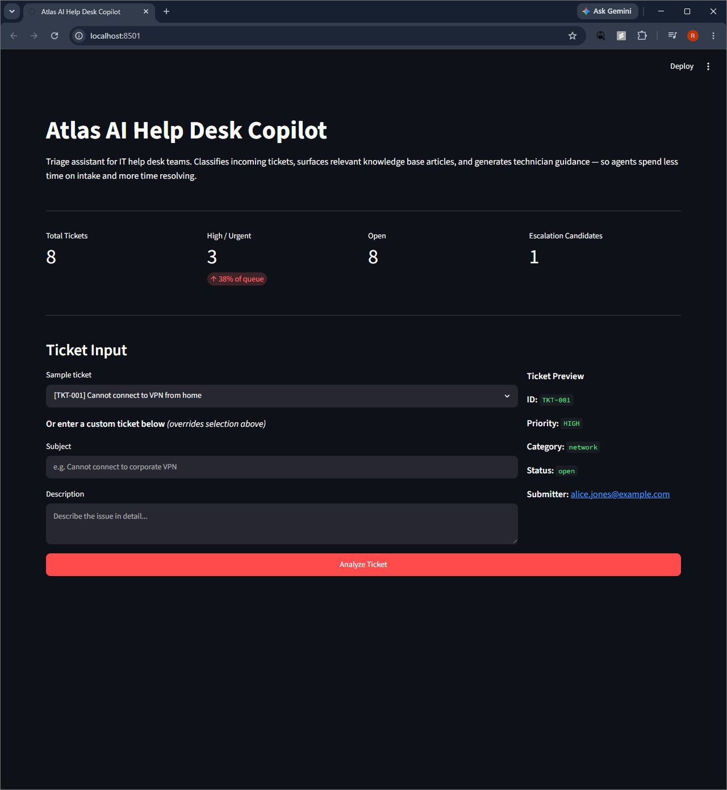
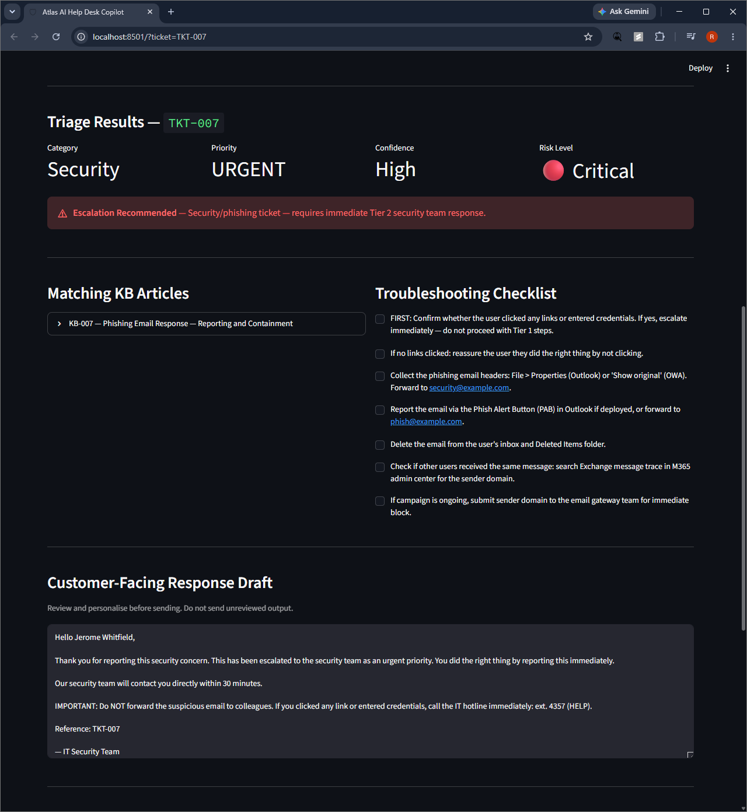
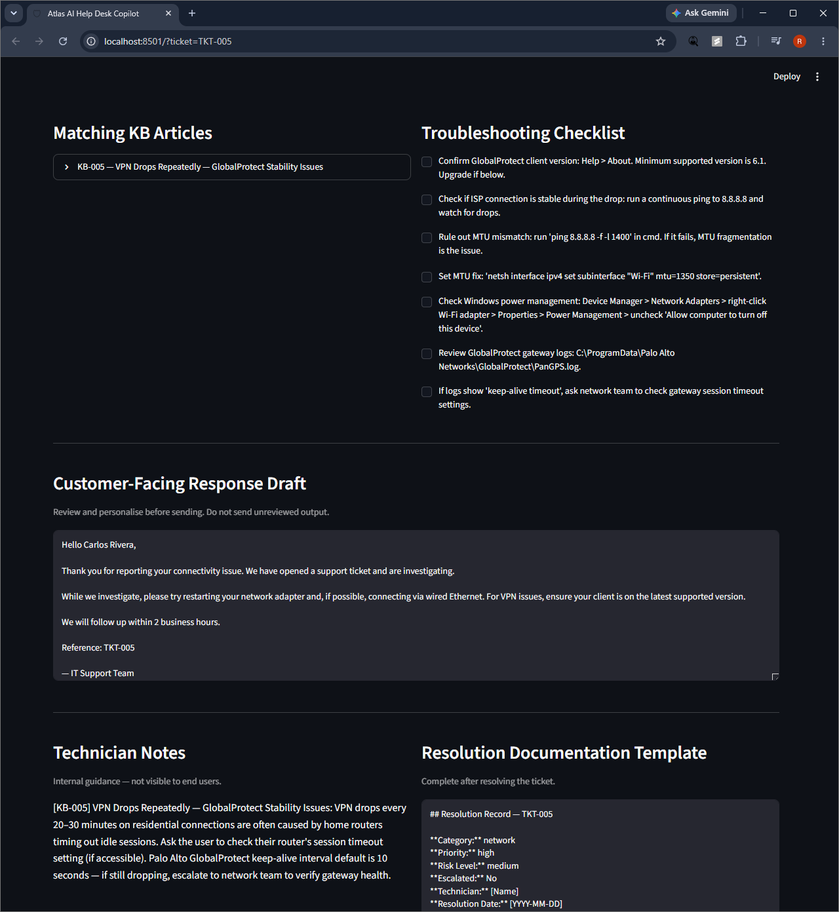
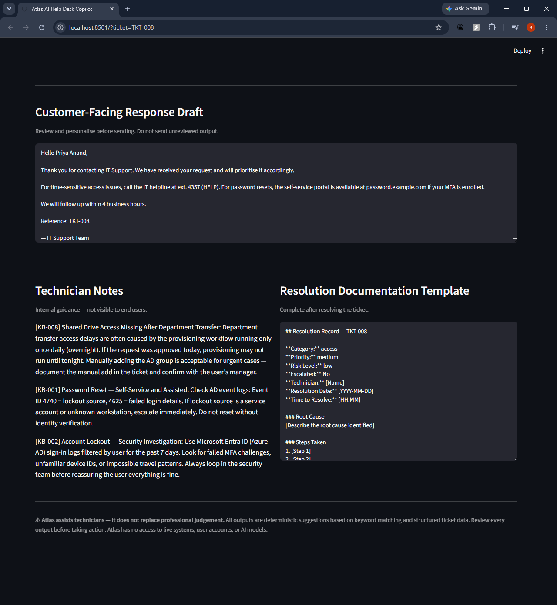
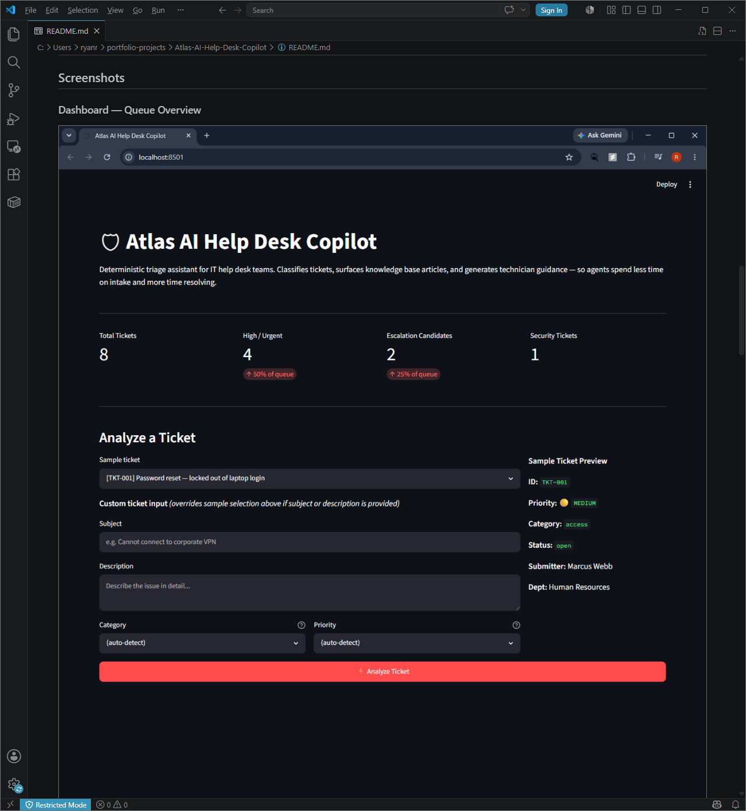

# Atlas AI Help Desk Copilot

## Recruiter TL;DR

Help desk triage tool built with Python and Streamlit. Classifies support tickets by category and priority, surfaces matching KB articles, generates technician checklists and response drafts, and flags phishing/security tickets for escalation. Demonstrates Tier 1 help desk workflow knowledge — ticket intake, triage logic, escalation awareness, and documentation. Python and tests are secondary to the support domain focus.

---

**A deterministic triage assistant that classifies IT support tickets, surfaces knowledge base articles, and generates technician guidance — built to demonstrate real help desk workflows without any live systems or AI dependencies.**

---

## What This Project Proves

This project demonstrates practical IT support skills alongside Python development:

- **Help desk domain knowledge** — ticket triage logic, escalation rules, and KB article structure reflect real Tier 1/2 workflows
- **Escalation awareness** — phishing detection, credential compromise handling, and escalation paths follow structured help desk escalation practices
- **Tool-building for IT teams** — a working Streamlit app a real help desk agent could walk through during a demo
- **Test-driven development** — 32 passing tests covering data validation, triage logic, and module integrity
- **Professional documentation** — structured runbooks, case study, and demo script

---

## Problem It Solves

Tier 1 help desk agents handle high ticket volume and spend significant time on intake: reading the ticket, deciding the priority, searching the KB, and drafting a response. Atlas demonstrates how a lightweight triage tool can front-load that work — giving agents a structured starting point on every case.

---

## Key Features

| Feature | What It Does |
|---|---|
| **Dashboard metrics** | Queue overview: total tickets, high/urgent count, escalation candidates, security flags |
| **Ticket selector** | 8 realistic demo tickets covering the most common IT support scenarios |
| **Custom ticket input** | Paste any ticket subject and description; Atlas classifies it on the fly |
| **Deterministic triage** | Category, priority, confidence, and risk level — no AI, fully explainable |
| **Security escalation** | Phishing and credential-compromise tickets auto-escalate with specific reasoning |
| **KB article matching** | Relevant knowledge base articles surfaced by category and symptom keywords |
| **Troubleshooting checklist** | Step-by-step checklist pulled from matching KB articles |
| **Response draft** | Customer-facing email draft, pre-populated and ready for technician review |
| **Technician notes** | Internal guidance with AD commands, event log IDs, and vendor-specific tips |
| **Resolution template** | Structured documentation template to complete after ticket closure |

---

## Demo Workflow

1. Open the app: `streamlit run app.py`
2. Review the dashboard — note the escalation candidates and security tickets
3. Select **TKT-007** (phishing ticket) from the dropdown
4. Click **Analyze Ticket**
5. Observe: security override fires, risk level shows Critical, escalation banner appears
6. Review the KB article, response draft, and technician notes
7. Try a custom ticket — paste any IT issue and see auto-classification

---

## Demo Tickets

| ID | Scenario | Priority | Escalates? |
|---|---|---|---|
| TKT-001 | Password reset | Medium | No |
| TKT-002 | Account locked from unknown location | High | Yes |
| TKT-003 | Slow laptop after Windows Update | Low | No |
| TKT-004 | Shared printer offline (5 users blocked) | High | No |
| TKT-005 | VPN drops every 20–30 minutes | High | No |
| TKT-006 | Outlook not syncing for 18 hours | Medium | No |
| TKT-007 | Phishing email (did not click) | Urgent | Yes |
| TKT-008 | Shared drive missing after department transfer | Medium | No |

---

## Tech Stack

| Component | Technology | Why |
|---|---|---|
| UI | Streamlit | Rapid dashboard UI, no frontend boilerplate |
| Triage logic | Pure Python | Deterministic, testable, no API costs |
| Demo data | JSON | Portable, no database required |
| Tests | pytest | 32 tests covering data, triage, and imports |
| Environment | Python 3.12+ / Windows | Matches common enterprise desktop environment |

---

## Local Setup

See [docs/LOCAL_SETUP.md](docs/LOCAL_SETUP.md) for full instructions.

**Quick start (PowerShell):**

```powershell
python -m venv .venv
.venv\Scripts\Activate.ps1
pip install -r requirements.txt
streamlit run app.py
```

App opens at `http://localhost:8501`

---

## Run Tests

```powershell
python -m pytest --tb=short -q
```

---

## Project Structure

```
Atlas-AI-Help-Desk-Copilot/
├── app.py                        # Streamlit single-page app
├── requirements.txt
├── CLAUDE.md                     # Project rules for AI-assisted development
├── data/
│   ├── sample_tickets.json       # 8 realistic demo tickets
│   └── knowledge_base.json       # 8 KB articles (one per scenario)
├── src/atlas/
│   ├── demo_data.py              # Loaders for tickets and KB
│   └── triage.py                 # Deterministic triage engine
├── tests/
│   ├── test_demo_data.py         # 11 data validation tests
│   ├── test_triage.py            # 17 triage logic tests
│   └── test_app_import.py        # 4 module integrity tests
├── docs/
│   ├── CASE_STUDY.md
│   ├── USE_CASES.md
│   ├── LIMITATIONS.md
│   ├── LOCAL_SETUP.md
│   ├── DEMO_SCRIPT.md
│   └── screenshots/              # Added in Phase 6
└── .claude/agents/               # Review gate agents for AI-assisted dev
```

---

## Screenshots

### Dashboard — Queue Overview



*Dashboard on load: 8 tickets in queue, 4 high/urgent, 2 escalation candidates, 1 security ticket. Ticket selector and custom input ready for analysis.*

---

### Phishing Ticket Triage — Critical Risk + Escalation



*TKT-007: Phishing email reported by an IT staff member. Atlas detects security keywords, overrides the category to Security, sets risk to Critical, and fires the escalation banner with a specific reason — before the technician has done anything.*

---

### Troubleshooting Plan — KB Articles and Checklist



*TKT-005: Repeating VPN drops. Atlas matches the GlobalProtect stability KB article, expands escalation triggers, and generates a ranked checklist — MTU check, power management fix, and gateway log review — ready for the technician to work through.*

---

### Documentation Output — Resolution Template



*TKT-008: Shared drive missing after department transfer. The resolution template is pre-filled with ticket ID, category, priority, risk level, and escalation status — technician fills in root cause and steps taken after resolving.*

---

### README Preview — Portfolio Documentation



*The README is written HR-first: headline, what it proves, demo workflow, and honest limitations — before the technical stack. A hiring manager can assess the project in under 2 minutes without cloning it.*

---

## Limitations

See [docs/LIMITATIONS.md](docs/LIMITATIONS.md) for full details.

- Demo data only — not connected to any live ticket system
- No real user accounts, authentication, or directory integration
- Triage is keyword-based and deterministic — not AI and not infallible
- All outputs must be reviewed by a technician before action is taken
- Not a replacement for policy, judgment, or escalation procedures

---

## Future Improvements

- Ticket ingestion from ServiceNow, Jira Service Management, or Freshdesk via API
- Confidence scoring based on ticket history and resolution feedback
- Role-based views (Tier 1 vs. Tier 2 vs. security team)
- Weekly ticket trend reporting
- Integration with Microsoft Entra ID for live account status lookup

---

## Docs

- [Case Study](docs/CASE_STUDY.md) — build process and lessons learned
- [Use Cases](docs/USE_CASES.md) — all 8 demo scenarios explained
- [Limitations](docs/LIMITATIONS.md) — honest scope boundaries
- [Local Setup](docs/LOCAL_SETUP.md) — step-by-step setup guide
- [Demo Script](docs/DEMO_SCRIPT.md) — 60–90 second walkthrough script
